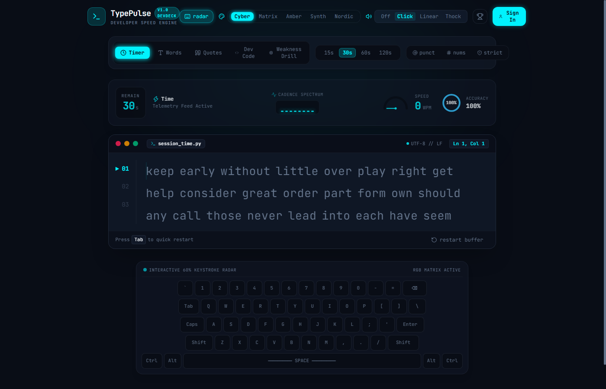

# ⚡ TypePulse — Developer Speed Cockpit & Telemetry Deck

<div align="center">



### *The High-Performance, Cyber-Aesthetic Typing Arena for Developers & Speed Typists*

[](https://github.com)
[](https://deepmind.google)
[](https://deepmind.google)
[-009688?style=for-the-badge&logo=fastapi&logoColor=white)](https://fastapi.tiangolo.com)
[](https://react.dev)
[](https://tailwindcss.com)

</div>

---

> [!NOTE]
> **🚀 Vibe Coded with Google Antigravity (Gemini 3.8 Flash)**  
> **TypePulse** was vibe coded from scratch into a full-stack production platform using **Google Antigravity** powered by the **Gemini 3.8 Flash** advanced agentic model. From sub-millisecond driftless timer calculus and Web Audio API acoustic switch synthesis to the custom IDE DevDeck telemetry bar and 15 custom color themes, the entire platform was crafted with deep autonomy, real-time feedback loops, and precision agentic engineering.

---

## 🌟 What is TypePulse?

**TypePulse** re-imagines the classic speed typing benchmark into an **IDE-inspired studio deck**. Instead of clichéd flat cards, TypePulse provides a high-octane developer arena equipped with:

* 🏎️ **Cockpit Telemetry Bar**: Live tachometer speedometer gauge, real-time typing cadence spectrum equalizer, and circular accuracy ring.
* ⌨️ **60% Mechanical Keystroke Radar**: Interactive virtual keyboard that lights up keycaps and heatmaps your physical keystrokes in real time.
* 🔊 **Native Web Audio Synthesizer**: 8 distinct mechanical switch acoustics synthesized via Web Audio API (zero audio file downloads, zero latency).
* 🐍 **Developer Code Mode**: Benchmark your speed on real, syntax-aware **Python**, **JavaScript**, and **SQL** code snippets with indentation and symbol handling.
* 🧠 **AI-Powered Weakness Drills**: Python NLP engine that extracts your error bigrams (e.g. `th`, `pr`, `ion`) and dynamically generates customized training sentences to fix muscle-memory bottlenecks.
* 🎨 **15 Curated Color Themes**: From cyberpunk neon and hacker terminals to soothing matcha tea and Japanese cherry blossom light modes.
* ⏱️ **Driftless Precision Engine**: Sub-millisecond timing powered by `performance.now()` delta math with locked typographic non-breaking space baselines.

---

## 🎨 15 Custom Studio Themes

TypePulse features an extensive theme engine, switchable on-the-fly and persistent across browser reloads:

### Dark & Cyber Themes
* 🟦 **Cyber Carbon** *(Default)*: Futuristic terminal navy with electric cyan glow
* 🟩 **Matrix Terminal**: Phosphor green monochrome on deep void black
* 🟧 **Amber CRT**: Nostalgic 1980s computer terminal glow
* 🟪 **Synthwave 84**: Outrun neon magenta and deep indigo
* ❄️ **Nordic Frost**: Arctic slate and glacial blue
* ⚡ **Cyberpunk 2077**: High-voltage neon yellow, onyx, and electric cyan
* 🧛 **Dracula Vampire**: Gothic charcoal, pastel violet, and neon pink
* 🍃 **Monokai Pro**: Classic code editor dark olive, lime, and orange
* 🌌 **Tokyo Night**: Midnight anime cobalt and soft lavender
* 📜 **Warm Sepia**: Vintage typewriter parchment and aged walnut

### Clean Light Themes
* 📄 **Paper Light**: Crisp daylight slate, deep ocean ink, and emerald accents
* ☀️ **Solarized Light**: Ivory paper, golden amber, and deep teal navy
* 🌸 **Sakura Blossom**: Soft blush pink with Japanese cherry blossom accents
* 🏔️ **Nord Snow**: Pure arctic snow, polar slate, and glacier ice
* 🍵 **Matcha Tea**: Botanical Japanese tea leaf ivory with forest moss green

---

## 🔊 8 Mechanical Switch Sound Profiles

Experience realistic mechanical keyboard acoustics synthesized in real-time via Web Audio API:

1. **Crisp Clicky (Blue Switch)**: Sharp click-leaf snap with solid bottom-out impact.
2. **Smooth Linear (Red Switch)**: Soft, dampened bottom-out with minimal acoustic resistance.
3. **Deep Thock (Holy Panda)**: Resonant low-frequency acoustic thock with deep switch body sound.
4. **Lubed Creamy (Custom Lubed)**: Velvety, buttery double-tap with low-pass acoustic warmth.
5. **Metal Typewriter (Mechanical Strike)**: High-frequency metallic steel strike with solid carriage platen impact.
6. **Water Bubble (Bubble Pop)**: Cheerful buoyant water droplet pop and chirp.
7. **8-Bit Beep (Arcade Blip)**: Retro CRT terminal square wave frequency pulses.
8. **Mute / Silent**: Zero audio for pure distraction-free focus.

> **Instant Audio Testing**: Each sound profile in the **Settings** modal features a **`▶ Test`** button to preview switch acoustics instantly!

---

## 🛠️ Full Tech Stack

```
┌────────────────────────────────────────────────────────────────────────┐
│                          Frontend (Client)                             │
│  • Vite + React 19 (TypeScript) + Tailwind CSS                         │
│  • Driftless Engine: performance.now() delta millisecond calculus      │
│  • Smooth 3-line sliding viewport with dynamic line numbers (01, 02)   │
│  • Web Audio API Synthesizer: 8 organic acoustic profiles              │
│  • Recharts Analytics: WPM, Raw WPM, Errors & Consistency over time    │
│  • 60% Virtual Keystroke Radar with active key glow                    │
└───────────────────────────────────┬────────────────────────────────────┘
                                    │
                            REST API (JSON)
                                    │
┌───────────────────────────────────▼────────────────────────────────────┐
│                          Backend (FastAPI)                             │
│  • Python 3.12 + FastAPI (Async & OpenAPI)                             │
│  • NLP Weakness Analyzer: Bigram/Trigram mistake pattern extraction    │
│  • Anti-Cheat Engine: Timestamp variance & burst detection (<25ms)    │
│  • Code Snippet Engine: Curated Python, JS, and SQL snippets           │
│  • SQLModel ORM: SQLite (local) / PostgreSQL (production ready)        │
│  • JWT Authentication & Argon2 password hashing                        │
└────────────────────────────────────────────────────────────────────────┘
```

---

## 🚀 Quick Start (Run Locally)

### 1. Prerequisites
* **Python 3.12+**
* **Node.js 18+** and **npm**

### 2. Start Backend (FastAPI)
```bash
# In the project root
cd backend

# Create & activate virtual environment
python -m venv .venv
# On Windows:
.venv\Scripts\activate
# On macOS/Linux:
source .venv/bin/activate

# Install dependencies & run server
pip install -r requirements.txt
uvicorn app.main:app --reload --port 8000
```
Interactive Swagger API docs will be live at: **http://127.0.0.1:8000/docs**

### 3. Start Frontend (React 19 + Vite)
```bash
# In a separate terminal
cd frontend
npm install
npm run dev
```
Open **http://localhost:5173** in your browser to start typing!

---

## ☁️ 100% Free Production Deployment

TypePulse is optimized for the **Free Cloud Split (Vercel + Render)**:

* **Frontend**: Global CDN on **[Vercel](https://vercel.com)** (zero config, client-side routing handled via `vercel.json`).
* **Backend**: Free Python 3.12 Web Service on **[Render](https://render.com)** (auto-configured via `render.yaml`).

For a detailed 3-minute walkthrough, see [DEPLOYMENT_GUIDE.md](DEPLOYMENT_GUIDE.md).

---

## ⌨️ Pro Keyboard Shortcuts

| Shortcut | Action |
| :--- | :--- |
| `Tab` or `Tab + Enter` | Instantly restart session with a fresh buffer |
| `Ctrl + Backspace` | Delete entire current word input |
| `Esc` | Open / Close Studio Settings dialog |
| `Caps Lock` | Instant real-time warning badge |

---

## 📄 License
MIT License. Crafted with ❤️ and vibe-coded with **Google Antigravity (Gemini 3.8 Flash)**.
